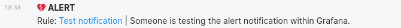

# Grafana to Matrix Forwarder
*Forward alerts from [Grafana](https://grafana.com) to a [Matrix](https://matrix.org) chat room.*

[](https://hectorjsmith.gitlab.io/grafana-matrix-forwarder/)
 [](https://gitlab.com/hectorjsmith/grafana-matrix-forwarder/-/commits/main) [](https://goreportcard.com/report/gitlab.com/hectorjsmith/grafana-matrix-forwarder)

---

This project provides a simple way to forward alerts generated by Grafana to a Matrix chat room.

Define a Grafana webhook alert channel that targets an instance of this application.
This tool will convert the incoming webhook to a Matrix message and send it on to a specific chat room.



## 1. Features

  * 📦 **Portable**
    * As a single binary the tool is easy to run in any environment
  * 📎 **Simple**
    * No config files, all required parameters provided on startup
  * 🪁 **Flexible**
    * Support multiple grafana alert channels to multiple matrix rooms
  * 📈 **Monitorable**
    * Export metrics to track successful and failed forwards

## 2. How to use
*This applies to unified alerts, check the [documentation](https://hectorjsmith.gitlab.io/grafana-matrix-forwarder/gettingStarted/grafana-legacy/) for legacy alerts*

**Step 1**

Run the forwarder by providing a matrix account to send messages from.

```
$ ./grafana-matrix-forwarder --user @userId:matrix.org --password xxx --homeserver matrix.org
```

**Step 2**

Add a new **Contact Point** in Grafana with the **POST webhook** type. Use the following URL: 
```
http://<ip address>:6000/api/v1/unified?roomId=<roomId>
```

*Replace with the server ID and matrix room ID.*

**Step 3**

Add a new Notification Policy in Grafana to send alerts to the new contact point.

*If you use the root policy, all alerts will be sent to that contact point*

**Step 4**

Create alert rules in grafana and add text to the a "Summary" field to be displayed in the Matrix message.

## 3. Docker

An official docker image is available on the Gitlab container registry.
Use it by pulling the following image:

```
registry.gitlab.com/hectorjsmith/grafana-matrix-forwarder:latest
```

Example run command:
```
docker run -d \
    --name "grafana-matrix-forwarder" \
    -e GMF_MATRIX_USER=@user:matrix.org \
    -e GMF_MATRIX_PASSWORD=password \
    -e GMF_MATRIX_HOMESERVER=matrix.org \
    registry.gitlab.com/hectorjsmith/grafana-matrix-forwarder:latest
```

Read the [documentation](https://hectorjsmith.gitlab.io/grafana-matrix-forwarder/) for more detail on using Docker.

## Thanks

Made possible by the [maunium.net/go/mautrix](https://maunium.net/go/mautrix/) library and all the contributors to the [matrix.org](https://matrix.org) protocol.
